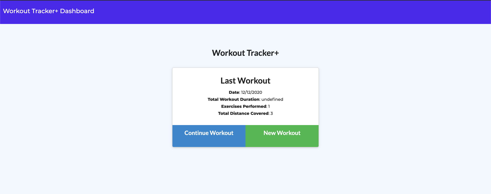

# Workout Tracker+
With this workout tracker app, user would be able to view create and track daily workouts, log multiple exercises in a workout on a given day, also to track the name, type, weight, sets, reps, and duration of exercise. If the exercise is a cardio exercise, user should be able to track the distance traveled.

User would be able to:

  * Add exercises to a previous workout plan.

  * Add new exercises to a new workout plan.

  * View the combined weight of multiple exercises on the Dashboard page.

This app is using MongoDB database to log user's data.

## Checkout Workout Tracker+:  
https://workout-tracker-plus.herokuapp.com/
